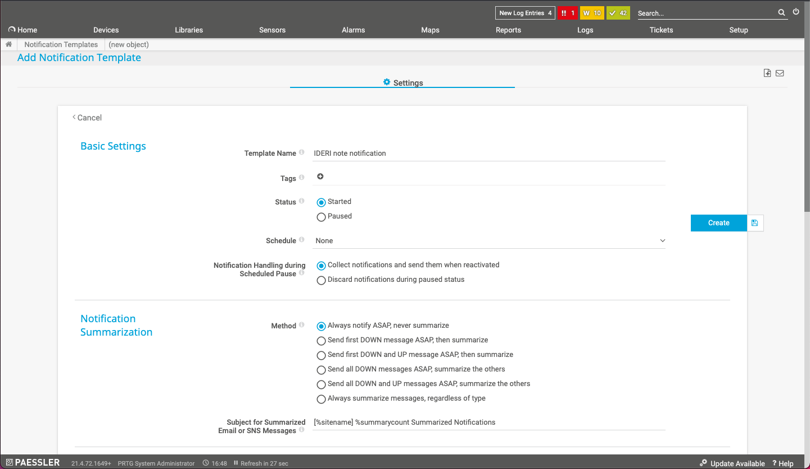
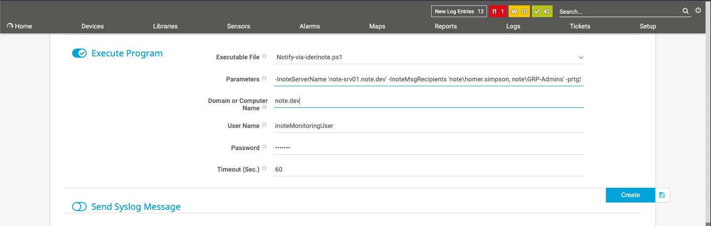

# notify-via-IDERInote PRTG notification script

## Description
This PRTG notification script can be used to create IDERI note messages out of PRTG using the script provided and 
    the IDERI note PowerShell module. It can, e.g., be used to automatically inform your IT administrators about 
    state changes of PRTG sensors directly on their desktops.

## How it works
If a sensor is configured to create a notification with the script, the script itself will check if an IDERI note message 
    has already been created for this particular sensor in the past. If not, the script will attempt to create a new 
    message on the IDERI note server specified, but will also log the sensor ID and the index of the newly created IDERI 
    note message to a file. If the sensor then will change states, the script will check again if a message for that sensor 
    has been created earlier and will attempt to update the message on the server instead of creating a new one each time 
    a notification for that sensor should be sent.
    This way the recipients will only get messages with the latest state of the sensor instead of multiple, maybe even 
    obsolete messages.

By default the file holding the assignments between PRTG sensor IDs and IDERI note message indexes is located in 
    __%PROGRAMDATA%\\IDERI\\note-PRTG-notification\\sensorIdToMessageID.db.csv__ on the PRTG server.

## Prerequesites
- PRTG version: >=20.1.57
- IDERI note PowerShell Module installed on the PRTG server.
- The user executing the script must have write access on directory __%PROGRAMDATA%\\IDERI\\note-PRTG-notification\\*__.

## Installation
- Install the IDERI note PowerShell Module from the latest inote.exe. (You can download it from the IDERI note homepage.)

- Download the notification script "notify-via-IDERInote.ps1" from the repository. 
    (https://github.com/ideri/IDERInote/blob/PRTG_plugins/PRTG_plugins/PRTG_notification/notify-via-IDERInote.ps1)

- Copy the script to your PRTG installations notification directory. <br/> (Default: 
    __*"C:\Program Files (x86)\PRTG Network Monitor\notifications\exe\notify-via-IDERInote.ps1"*__)

- Done. Now you can continue with configuring the script in PRTG.

## How to setup

### Step by step
- Login to PRTG as an administrator.

- Navigate to __*Setup -> Notification Templates*__ and add a new template by pressing __*Add Notification Template*__ 
    via the "__+__" on the right hand side.

- Give the new template a name in the *Basic Settings* section.

- In the *Notification Summeriation* section choose the *Always notify ASAP, never summarize* as Method.
    

- Scroll further down and enable the __*Execute Program*__ check box. Select the "*notify-via-iderinote.ps1*" 
    script as the *Executable File*. If it is not selectable in the dropdown check again if you've copied the 
    script to the right directory.
- In the *Parameters* field add the following parameters:<br/>
    ```
    -InoteServerName '<IDERInoteServer>' -InoteMsgRecipients '<domain>\<user>, <domain>\<group>, <domain>\<computer>$' -prtgSensorID '%sensorid' -prtgDevice '%device' -prtgName '%name' -prtgLastStatus '%laststatus' -prtgDown '%down' -prtgMessage '%message' -prtgSitename '%sitename'
    ```
    These are a set of the mandatory parameters you have to specify. Please replace the values inside the "< ... >" 
    with the values of your environment.
    If you want to specify multiple recipients you can do so by comma separating them, as seen in the example.

    > **Note:**
    > The notification script has some optional parameters you can use. For a list of all parameters available 
      scroll down to the [Parameters available](#parameters-available) section.

- Next fill out  the *Domain or Computer Name*, *User Name* and *Password* fields. The user specified here will create/update 
    the IDERI note messages on the IDERI note server. Therefore this user must have the appropriate rights in IDERI note to 
    do so. Furthermore make sure that this user has write access to the __%PROGRAMDATA%\\IDERI\\note-PRTG-notification\\*__ 
    directory (__Important!__).
    
  
- After you've configured the template to your needs click the *Create* button on the right hand side of the window.


## Parameters available

| Parameter                 | Mandatory | Description                                                                                                                                                    |
|---------------------------|-----------|----------------------------------------------------------------------------------------------------------------------------------------------------------------|
| InoteServerName           | true      | The server name/IP address of the IDERI note server.                                                                                                           |
| InoteServerPort           | false     | The administration TCP port of the IDERI note server.                                                                                                          |
| InoteMsgDurationMinutes   | false     | The duration in minutes the IDERI note message should be valid for. (Default: 60)                                                                              |
| InoteMsgShowPopup         | false     | Show the IDERI note message in a PopUp window. (Default: true)                                                                                                 |
| InoteMsgShowTicker        | false     | Show the IDERI note message in a ticker. (Default: false)                                                                                                      |
| InoteMsgRecipients        | true      | The recipients for the IDERI note message as a comma separated string in format '\<domain\>\\\<object\>' (Example: 'note\\user1, note\\grp-name, note\\pc01$') |
| InoteMsgExcludes          | false     | The excludes for the IDERI note message as a comma separated string in format '\<domain\>\\\<object\>' (Example: 'note\\user1, note\\grp-name, note\\pc01$')   |
| InoteMsgNotifyReceive     | false     | Notify the IDERI note server when message is received.                                                                                                         |
| InoteMsgNotifyAcknowledge | false     | Notify the IDERI note server when message is acknowledged.                                                                                                     |
| InoteMsgAddressingMode    | false     | The addressing mode of the IDERI note message. (Default: 'UserAndComputer'; Possible values: 'UserOnly', 'UserAndComputer', 'ComputerOnly')                    |
| prtgSensorID              | true      | Must be '%sensorid'.                                                                                                                                           |
| prtgDevice                | true      | Must be '%device'.                                                                                                                                             |
| prtgName                  | true      | Must be '%name'.                                                                                                                                               |
| prtgLastStatus            | true      | Must be '%laststatus'.                                                                                                                                         |
| prtgDown                  | true      | Must be '%down'.                                                                                                                                               |
| prtgMessage               | true      | Must be '%message'.                                                                                                                                            |
| prtgSitename              | true      | Must be '%sitename'.                                                                                                                                           |
| prtgHome                  | false     | Must be '%home'. If specified, the IDERI note message has a link to the sensor included.                                                                       |

## Troubleshooting
__...TODO__: 
