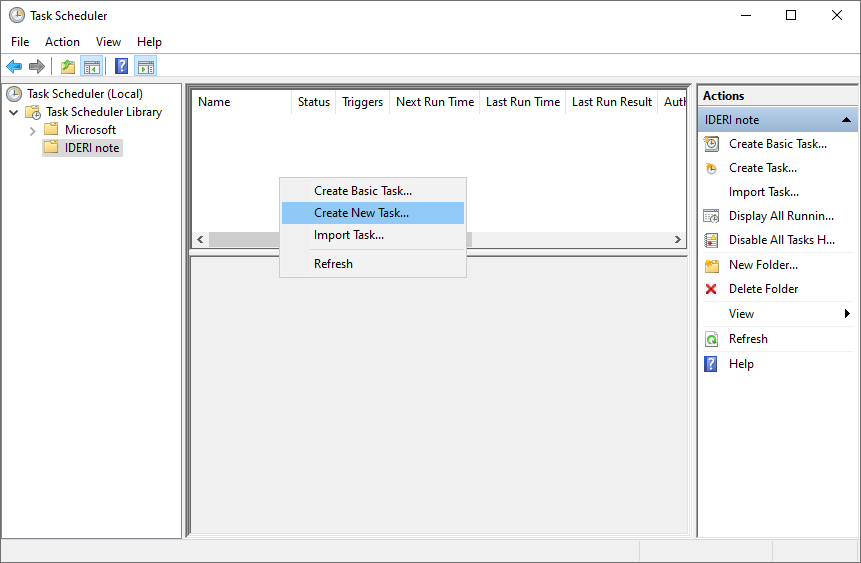
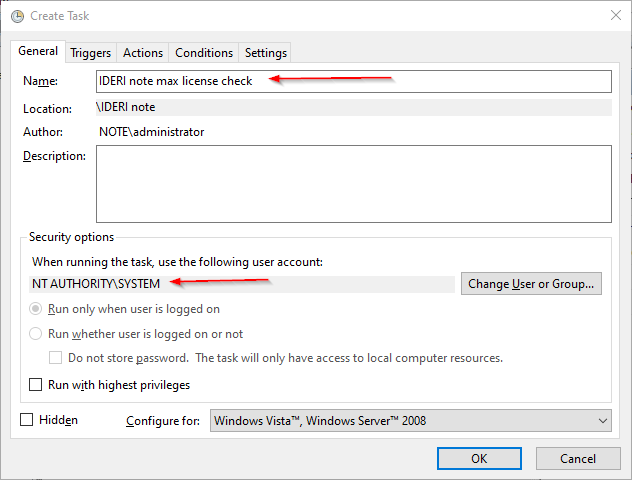
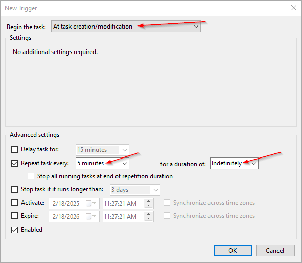
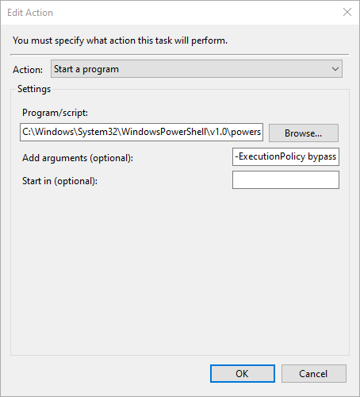
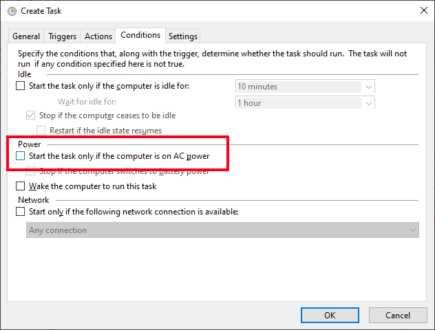

# Log maximum number of IDERI note Desktop licenses used

## Description and purpose
If you want to get the maximum number of IDERI note licenses you'll need in your environment, you can run this script periodically using a scheduled task and have the maximum number of licenses used written to a file.

Ask IDERI GmbH for a temporary, time-limited IDERI note license to ensure you have more licenses than IDERI note client connections.

## How to setup

### Prerequesites
* The script currently must run on the server with the IDERI note service installed.
* The IDERI note PowerShell module must be installed on the server running the IDERI note Service.

### Step by step

* Download the script and save it on the IDERI note server.
* Open task scheduler from start menu or run *taskschd.msc* directly.
* Create a new Task.


* On the *General* tab give the task a name and make sure to set the executing user account to the *NT AUTHORITY\SYSTEM*.<br>


- Switch over to the *Triggers* tab and create a new trigger. Set it to *At task creation/modification*, tick the checkbox for *Repeat task every:* and set a value that fits your needs. Confirm with *OK*.<br>


* Next switch to the *Actions* tab and create a new action. Set the action to *Start a program* and set the Program/script to 
    ```
    C:\Windows\System32\WindowsPowerShell\v1.0\powershell.exe
    ```

    In the "*Add arguments (optional):*" box enter 


    ```
    -ExecutionPolicy bypass -WindowStyle Hidden -File "<PATHTOSCRIPT>\InoteLicCheck.ps1"
    ```
  
    Make sure to modify the `<PATHTOSCRIPT>` section to the path where your script is located.<br>


* Last but not least switch to tab *Conditions* and **untick** the **Start the task only if the computer is on AC power** option.<br>


* Create the task by pressing *OK*.

### Conclusion
When the task has run you should find multiple new files in the script directory named *IDERInote-MaxLicsUsed.csv* (on success) or *IDERInote-MaxLicsUsed-Error.log* (only on error) and an *IDERInote-MaxLicsUsed-lastExecution.log*.
* The *IDERInote-MaxLicsUsed.csv* file contains the highest license count recorded and the date it was first logged. The file only gets updated when the current license count used is higher than the previous one recorded.
* The *IDERInote-MaxLicsUsed-Error.log* file contains error information, if any occurred.
* The *IDERInote-MaxLicsUsed-lastExecution.log* file contains the output of the last execution of the script.