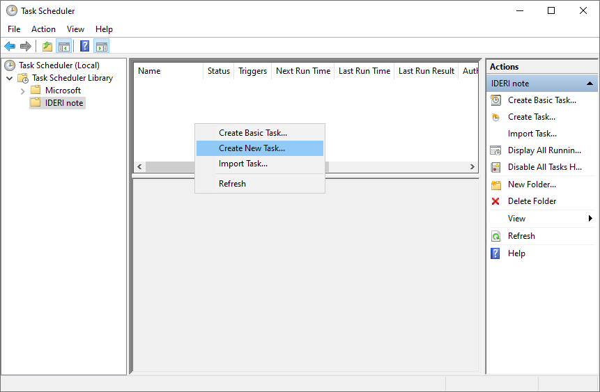
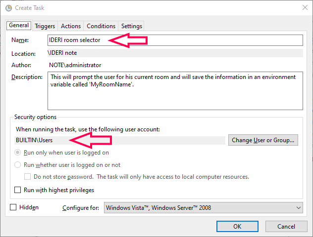
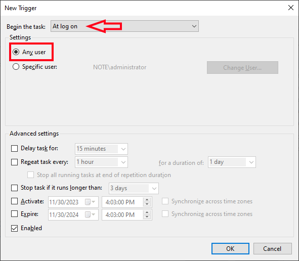
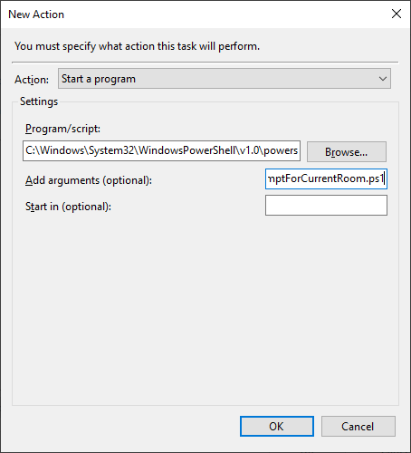
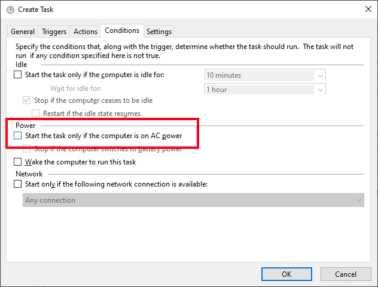
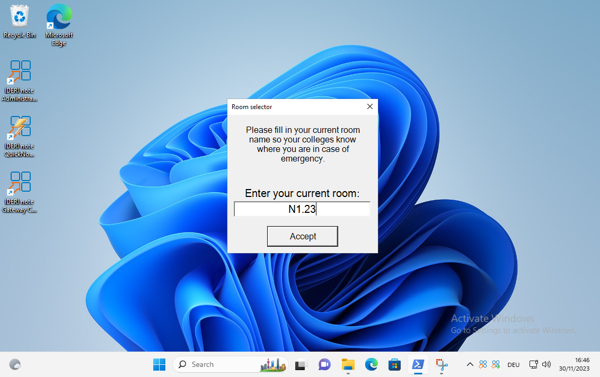
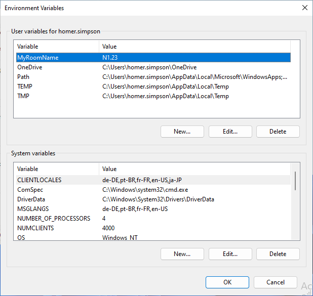
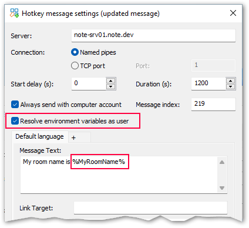
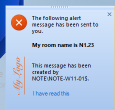

# PromptForCurrentRoom PS script

## Description
This script shows an UI that asks for the current location (room name/number) of the user. The given value will then be saved in an user environment variable. This variable again can be used, e.g. with the IDERI note Hotkey component.

## Purpose
### Example
You use IDERI note HotkeySupport to quickly inform your colleagues that you find yourself in a threatining situation and need help. Best case is that the message already contains the current location and room number you are currently situated. No problem if you always work in the same place. Just set the room number statically in the message. But what if you have a laptop and switch your room from time to time?

You need a solution to update your current room info manually and use this info in your IDERI note HotkeySupport message, but without the need of administrative rights.

### Solution
Thats what this script is for! It will prompt you for your current location info and than saved it to user environment variable that you can use in your message text of the IDERI note Hotkey. As it is a user env var there is no need for elevated rights to update the information.

## How to setup 

### Modify script variables
First open the .ps1 file with an editor of your choice and modify the values in the VARIABLES section to your needs. The most important variable value is the *$ENV_VAR_NAME* which defaults to *MyRoomName*. This will be the Name of the environment variable you can later on use in the IDERI note Hotkey by specifing it like *%MyRoomName%*.

### Add a scheduled task
This is completely optional as you can, of cause, always execute the script manually of find other ways to execute the script periodically. But for this example we add a scheduled task that will prompt the user on every logon.

- Open task scheduler from start menu or run *taskschd.msc* directly.
- Create a new Task.  

- On the *General* tab give the task a name and make sure to set the executing user account to the *BULTIN\Users* group. 

- Switch over to the *Triggers* tab and create a new trigger. Set it to *At log on* and make sure that the Setting *Any user* is ticked. Confirm with *OK*. 

- Next switch to the *Actions* tab and create a new Action. Set the Action to *Start a program* and set the Program/script to `C:\Windows\System32\WindowsPowerShell\v1.0\powershell.exe`. in the "*Add arguments (optional):*" box enter `-ExecutionPolicy Bypass -WindowStyle Hidden -File "<PATHTOSCRIPT>\PromptForCurrentRoom.ps1"`. Make sure to modify the `<PATHTOSCRIPT>` section to the path where your script is located. 

- Last but not least switch to tab *Conditions* and **untick** the **Start the task only if the computer is on AC power** option. 

- Create the task by pressing *OK*.

Now sign yourself out of windows and back in again. You should now be asked for your current room name. 

If you now enter your information and click *Accept* you will find a new user environment variable named *MyRoomNumber* (or to what name you've set variable name in the script) has been created. 

### Usage in the IDERI note Hotkey

In the IDERI note Hotkey you can now use the variable (in this example) *%MyRoomName%* in the message text. On execution of the hotkey the variable will be resolved to its current value. Make sure you ticked the *Resolve ennvironment variables as user* checkbox in the hotkey.  

