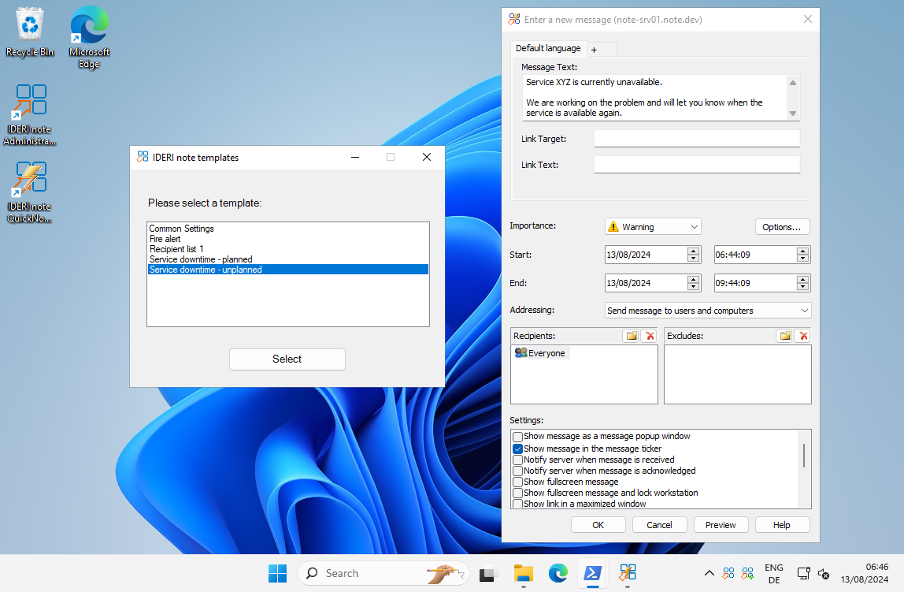
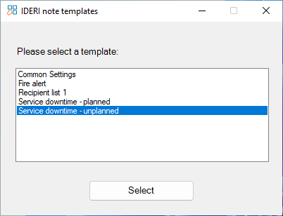
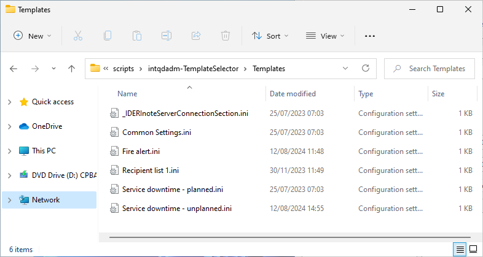

# intqdadm.exe TemplateSelector

## Description
This script displays an interface with a list of available intqdadm.exe ini templates for you to choose from.



## Purpose
### Example
As you may know, you can create an .ini template file and load it with the /ini parameter of the intqdadm.exe to predefine values in the UI for a new IDERI note message. [(Link to online help)](https://docs.ideri.com/note/help/en/Appendix_B_-_Command_Line_Parameters/intqdadm.exe_command_line_parameters.html)

If you now need to create more than one template, you will soon end up with a lot of different shortcuts for each template, which can quickly become confusing.

## Solution
This script addresses this by adding a UI with a list of all your ini templates to choose from. You can even specify a default connection template so you don't have to add the connection section to each template.



# How to setup
## Modify script variables
First, open the .ps1 file with an editor of your choice and change the values in the VARIABLES section to suit your needs.

| Variable name                 | Default value                                                        | Explanation                                                                        |
|-------------------------------|----------------------------------------------------------------------|------------------------------------------------------------------------------------|
| $TEMPLATE_FOLDER              | "$PSScriptRoot\Templates\"                                           | The folder that contains your ini templates.                                       |
| $INTQDADM_EXE_PATH            | "C:\Program Files (x86)\ideri\IDERI note Administrator\intqdadm.exe" | The path to the intqdadm.exe on your system.                                       |
| $DEFAULT_TEMPLATE             | ""                                                                   | The name of the template that should be preselected when the UI initially shows.   |
| $SRV_CONNECTION_INI_FILE_NAME | "_IDERInoteServerConnectionSection.ini"                              | The file name in the TEMPLATE_FOLDER that conains the default connection settings. |
| $LANGUAGE                     | "en"                                                                 | The language of the UI. (possible values: en, de)                                  |

## Creating templates
By default the templates should be in a folder called *Templates* located next to the .ps1 script file.
Add as many .ini files as you like to this folder and set the ini sections and values accordingly. An example ini file can be found in the IDERI note online help in section  [intqdadm.exe command line parameters](https://docs.ideri.com/note/help/en/Appendix_B_-_Command_Line_Parameters/intqdadm.exe_command_line_parameters.html). You can also find some sample template ini files in the [*Templates* folder](Templates/) in this repository.

Example template for a new message:
``` ini
[Message]
Lines=3
Line1=Service XYZ is currently unavailable.
Line2=
Line3=We are working on the problem and will let you know when the service is available again.
Importance=1	; Priority of type WARNING
Start=+0	    ; Starting now
End=+03/00/00	; Valid for 3 hours
ShowInTicker=1	; Show message in ticker

[Recipients]
;S-1-1-0 == SID of builtin group EVERYONE
AllowSid=S-1-1-0 
```

Folder with available templates:

 

## Server connection template
In most cases, you will only use a single IDERI note server in your environment for message creation. Although each template can have its own independent connection section, a common connection template can also be used so that you do not have to maintain the connections for each template separately. The connection template file to be used can be defined via the script variable **$SERVER_CONNECTION_SEKTION_INI_FILE_NAME** and should only contain the **[Connection]** ini section with its values.
You can find a [sample template ini file for the connection](Templates/_IDERInoteServerConnectionSection.ini) in the *Templates* folder in this repository.

Example of the content of a connection template file:
``` ini
[Connection]
Server=note-srv01.note.dev
ServerAD=0
Port=1024
PortAD=0
NamedPipes=1
LocalServerAsSelf=0
LoginAsSelf=1
user=
password=
domain=
WorkgroupLogin=0
```

## Create a shortcut for the script
To run the script with a double-click, create a new shortcut and set the target as shown in the code box below. Make sure you replace the *\<PATH>* value with the actual path to your script.

``C:\Windows\System32\WindowsPowerShell\v1.0\powershell.exe -ExecutionPolicy Bypass -WindowStyle Minimized -File "<PATH>\intqdadm-TemplateSelector.ps1"``

