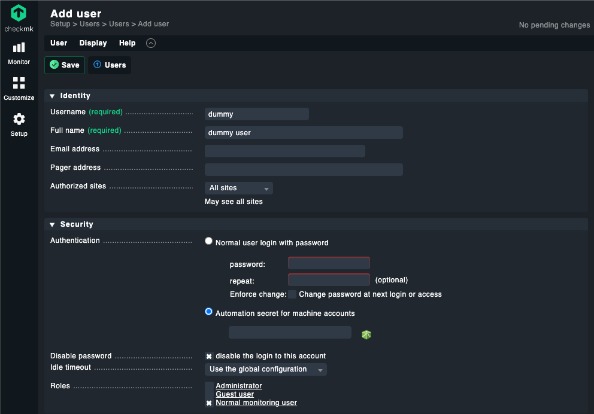
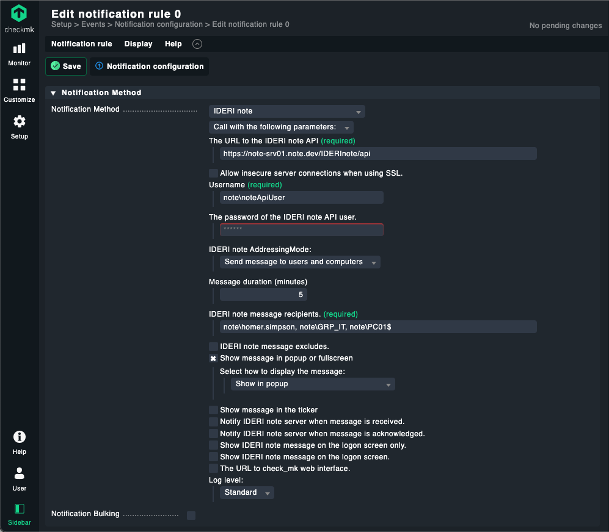
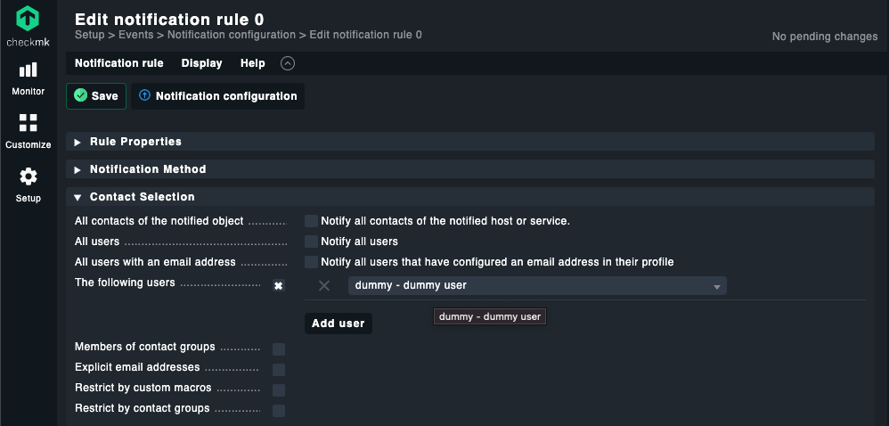

# notify-via-IDERInote Checkmk plugin

## Description
This Checkmk notification plugin can be used to create IDERI note messages out of Checkmk via the IDERI note web API.
It can, e.g., be used to automatically inform your IT administrators about incidents reported by Checkmk directly on their desktops.

## Prerequesites
- Checkmk version: >=2.0.0p25
- IDERI note web installed in
  
### Other requirements:
If the above prerequesites are fulfilled it is most likely that all of the following prerequesites are met, too, as Checkmk or python itself should already ship them.
- python3
- python3 modules: datetime, enum, json, posixpath, requests, urllib 


## Installation
- SSH on to your Checkmk server and switch to the site (e.g. ```su - cmk```)
- Download the latest .mkp package.
    ```shell
    wget https://github.com/ideri/IDERInote-checkMk_plugins/raw/main/notify-via-IDERInote/notify-via-IDERInote-0.8.mkp
    ```
- To install the package execute
    ```shell
    mkp install notify-via-IDERInote-0.8.mkp
    ```
- Afterwards you may restart the Checkmk apache instance
    ```shell
    omd restart apache
    ```

## How to setup
As IDERI note uses domain objects (users, computers and security groups) as recipient identifiers we currently cannot use the Checkmk users as recipients. But as Checkmk only sends notifications if a contact is specified in the rule, we first have to create a new dummy user in Checkmk. If we'd check the *Notify all users* box of the rule multiple identical IDERI note messages would be created for each Checkmk user.

### Step by step
- Login to Checkmk
- Navigate to __*Setup -> Users*__ and select __*Add user*__.
- Fill out the *Username* and *Full name* and check the '*disable the login to this account*' option.<br/>
    
- Create the new user by clicking the __*Save*__ button.
- Activate the changes.
- Navigate to __*Setup -> Notificatons*__ and select __*Add rule*__.
- Select **IDERI note** as the Notification Method and fill out all the required values and set the optional once to your needs.<br/>
    
- Scroll down to the *Contact selection* section, uncheck the '*Notify all contacts of the notified host or service*' option and select '*The following users*' option. Choose the dummy user you've just created from the list.<br/>
    
- Continue with configuring your notification rule to your needs and save by clicking the button __*Save*__.
- Done.

## Troubleshooting
The notify-via-IDERInote plugin has an optional parameter *Log level*. If you need to troubleshoot the functionality of the plugin you can set the parameter to a more verbose mode in the notification rule. The notification script will then write more data to the Checkmk notify.log the next time it gets executed.
 
 
> **Note:**
> Log levels *Debug* and *Trace* will write extensive amount of data to the notify.log and should be deactivated once the problem has been solved.
